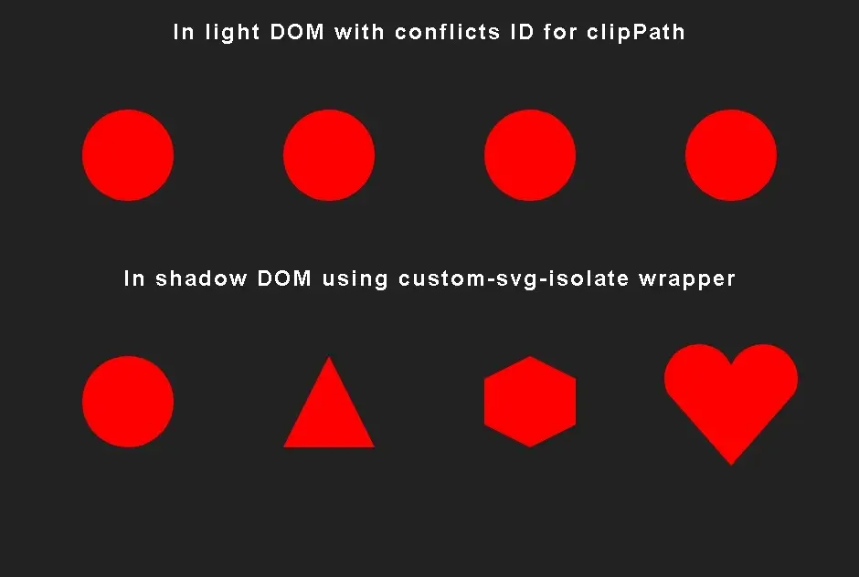

# SVG Isolate Custom Element


> In this example we have 4 svg: `circle.svg`, `triangle.svg`, `hexagon.svg` and `heart.svg` 
>
> Each one is using the same clipPath id `id="clipPath"` and this generates a conflict in the **light DOM**. 
>
> But using the `<custom-svg-isolate>` wrapper we can isolate the svg in **shadow DOM** and avoid ids and classes conflicts.

<br>

## Examples

- **Codepen**: 
[Example 1](https://codepen.io/FrancoJavierGadea/pen/MYwNLWd)
[Example 2](https://codepen.io/FrancoJavierGadea/pen/jEPgdyR)

<br>

## Installation

#### NPM

```bash
npm install @components-1812/svg-isolate
```

- [`SVG Isolate package`](https://www.npmjs.com/package/@components-1812/svg-isolate)

#### CDN

```html
<script type="module">
    import SVGIsolate from "https://cdn.jsdelivr.net/npm/@components-1812/svg-isolate@0.0.1/src/SVGIsolate.min.js";

    //Add the stylesheets to the component
    SVGIsolate.stylesSheets.links.push("https://cdn.jsdelivr.net/npm/@components-1812/svg-isolate@0.0.1/src/SVGIsolate.min.css");

    console.log(SVGIsolate);

    //Define the component
    customElements.define('custom-svg-isolate', SVGIsolate);
</script>
```

- **jsdelivr**: [`SVG Isolate package`](https://www.jsdelivr.com/package/npm/@components-1812/svg-isolate)
[`SVGIsolate.js`](https://cdn.jsdelivr.net/npm/@components-1812/svg-isolate@0.0.1/src/SVGIsolate.min.js)
[`SVGIsolate.css`](https://cdn.jsdelivr.net/npm/@components-1812/svg-isolate@0.0.1/src/SVGIsolate.min.css)

- **unpkg**: [`SVG Isolate package`](https://app.unpkg.com/@components-1812/svg-isolate)
[`SVGIsolate.js`](https://unpkg.com/@components-1812/svg-isolate@0.0.1/src/SVGIsolate.js)
[`SVGIsolate.css`](https://unpkg.com/@components-1812/svg-isolate@0.0.1/src/SVGIsolate.css)

<br>

## Usage

If you use Vite or a framework based on Vite such as Astro, you can import the component in a client-side script file:

```js
import '@components-1812/svg-isolate';
```

and use it in your HTML:

```html
<custom-svg-isolate>
    <svg width="200" height="200"><!-- SVG content --></svg>
</custom-svg-isolate>

<custom-svg-isolate src="path/tocircle.svg"></custom-svg-isolate>
```

> **Note:**
> 
> If you are using a builder or framework that doesn't support import ?raw, you need to load the component and its stylesheets manually.
> 
> see [Adding CSS stylesheets manually](#adding-css-stylesheets-manually)


<br>

## Adding CSS stylesheets manually

If you want to add custom stylesheets to the component or need to load stylesheets from a different path, you can do it like this:

- Using your builder’s import raw method, `CSSStyleSheet`, and the component’s `AdoptedStyleSheets` property:

    ```js
    import { SVGIsolate } from '@components-1812/svg-isolate/SVGIsolate.js';
    import SVGIsolateRawCSS from '@components-1812/svg-isolate/SVGIsolate.css?raw';

    const SVGIsolateCSS = new CSSStyleSheet();
    SVGIsolateCSS.replaceSync(SVGIsolateRawCSS);

    //Add the stylesheets to the component
    SVGIsolate.stylesSheets.adopted.push(SVGIsolateCSS);

    //Define the component
    import('@components-1812/svg-isolate/define');
    ```

<br>

- Using a `<style>` tag inside the shadow root of the component:

    ```js
    import { SVGIsolate } from '@components-1812/svg-isolate/SVGIsolate.js';
    import SVGIsolateRawCSS from '@components-1812/svg-isolate/SVGIsolate.css?raw';

    //Add the stylesheets to the component
    SVGIsolate.stylesSheets.raw.push(SVGIsolateRawCSS);

    //Define the component
    import('@components-1812/svg-isolate/define');
    ```

<br>

- Using a `<link>` tag inside the shadow root of the component:

    ```js
    import { SVGIsolate } from '@components-1812/svg-isolate/SVGIsolate.js';
    import SVGIsolateUrl from '@components-1812/svg-isolate/SVGIsolate.css?url';

    //Add the stylesheets to the component
    SVGIsolate.stylesSheets.links.push(SVGIsolateUrl);

    //Define the component
    import('@components-1812/svg-isolate/define');
    ```

<br>

> **Note:**
> 
> `import('@components-1812/svg-isolate/define')` calls `customElements.define('custom-svg-isolate', SVGIsolate);` in `define.js`

<br>

## Attributes

#### Reactive attributes

- `src`: Path to the svg file. Changes trigger the `loadSVG` method.

    At init time, if the `src` attribute is not set, the svg in the light DOM is used.

    ```html
    <custom-svg-isolate>
        <svg width="200" height="200"><!-- SVG content --></svg>
    </custom-svg-isolate>
    ```

<br>

#### Ready attributes

- `ready`: Set when the component is ready, and the svg is loaded in the shadow DOM. Set every time you change the `src` attribute or call `loadSVG` method.

- `ready-links`: Set when the links stylesheets are loaded.

<br>

## Events

- `ready`: Dispatched when the component is ready, and the svg is loaded in the shadow DOM. shoot every time you change the `src` attribute or call `loadSVG` method.

- `ready-links`: Dispatched when the links stylesheets are loaded.

<br>

## Methods

- `async loadSVG(src)`: Load an svg from a path and replace the current svg in the shadow DOM.

<br>

## License

MIT


